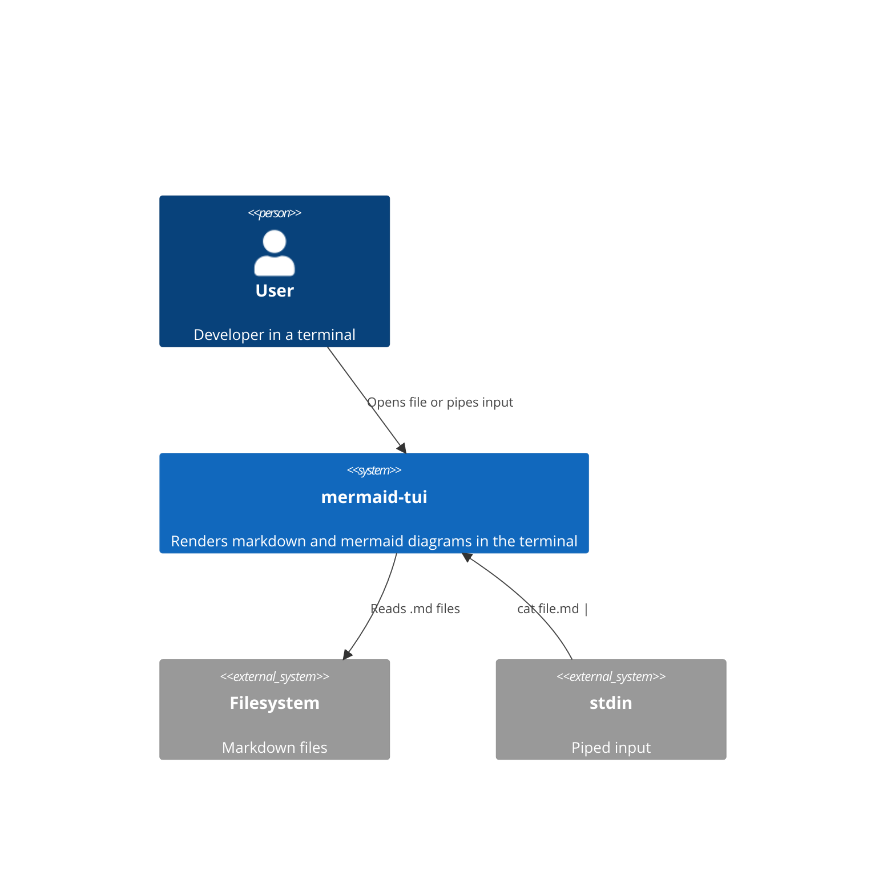
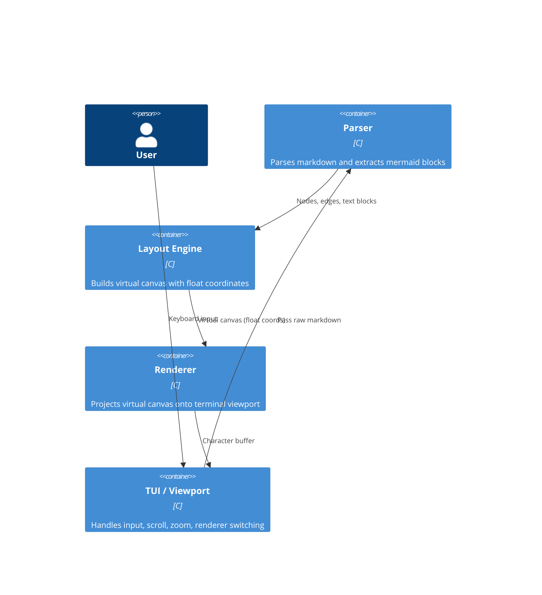
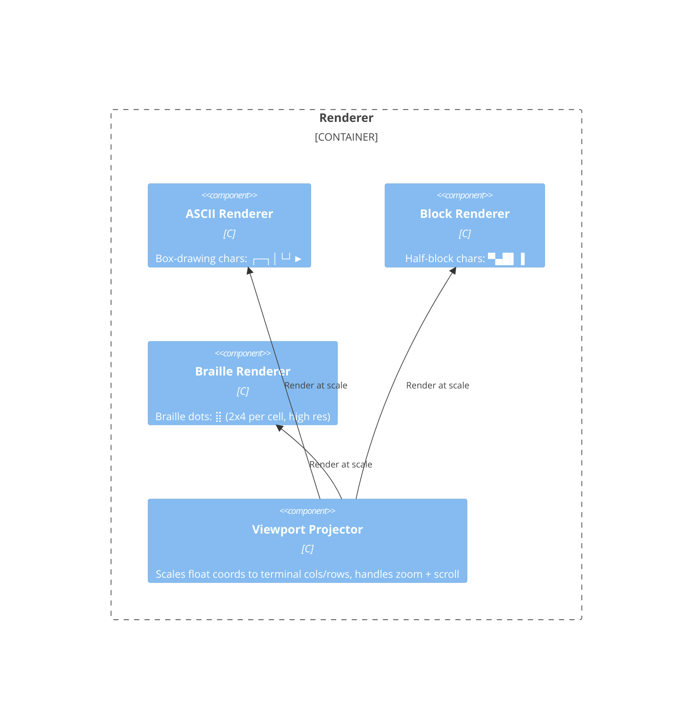
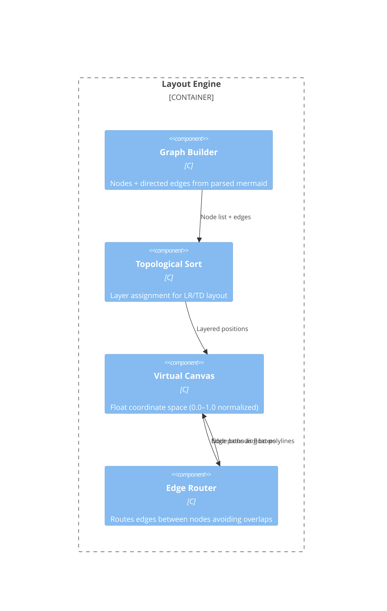

# Architecture (C4)

## Level 1 — System Context

---

## Level 2 — Container

---

## Level 3 — Component: Renderer

---

## Level 3 — Component: Layout Engine

---

## Key design decisions

| Decision | Choice | Reason |
|----------|--------|--------|
| Coordinate space | Normalized floats (0.0–1.0) | Zoom/scale independent of terminal size |
| Renderer selection | Runtime switchable (a/b/c key) | Compare quality interactively |
| Terminal size | `ioctl(TIOCGWINSZ)` on resize | Reflow on SIGWINCH |
| Zoom | Scale factor applied in viewport projector | Virtual canvas unchanged |
| Scroll | Offset in viewport projector | Virtual canvas unchanged |
| Language | C | Consistent with tasks tool, no runtime deps |
